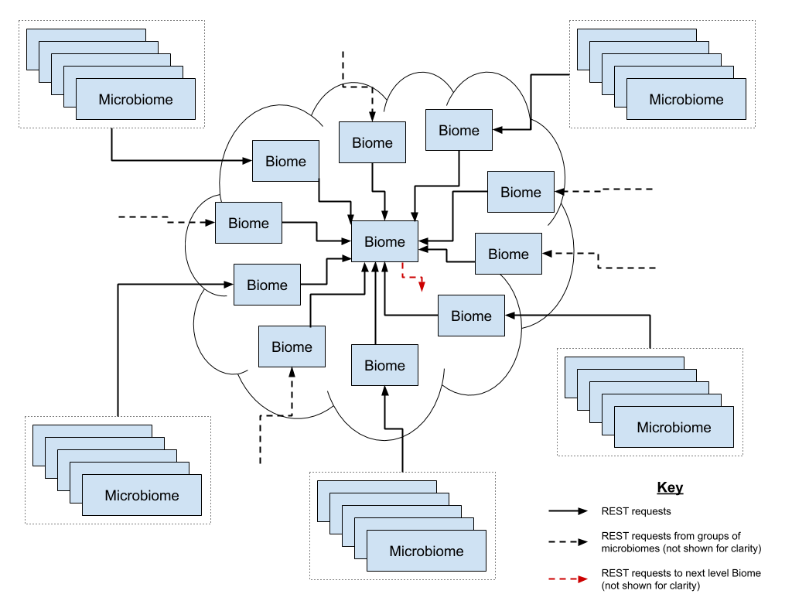
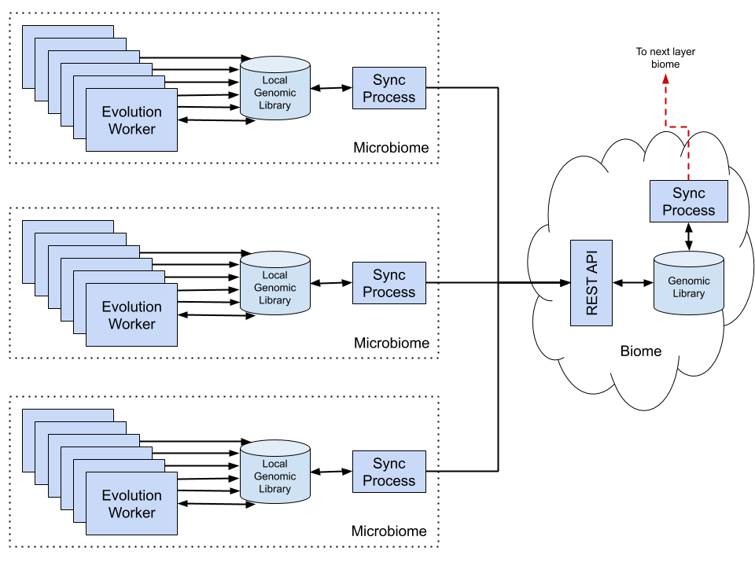

# Architecture

Erasmus GP has an infinitely scalable extended star network topology i.e. tree architecture. It consists of two principle elements:

1. Biomes
2. Microbiomes

## Biomes

Biomes are nodes in the network tree circulating genetic data between its children and passing it back up to its parent. A biome can support
many (TBD 10's, 100's, 1000's) children with the ultimate limiting factor being disk space to store the genetic
data. Biomes can also be layered infinitely deep which allows for infinite scalability.

The role of the biome is to:

1. Seed new microbiome or biome children with genetic data.
2. Validate genetic data in its subtree.
3. Populate derived genetic data fields for its subtree.
4. Manage resources for genes allowing the least generalised to become extinct in order to make space for new or more generalised genes.
5. Pull suitable 'alien' genetic data from its parent.
6. Push the most successful genetic data from its subtree to its parent.
7. Track its subtree of biomes and microbiomes to maintain consistent lineage & discovery data.

At the heart of the Erasmus network is a root Biome that provides all the same services to its children as any other biome.

## Microbiomes

Microbiomes are the leaf nodes where all the work is done. Microbiomes use a local genomic library to store the genetic data, periodically
synchronising it with its parent biome.

The role of the microbiome is to:

1. Evolve genetic codes to better solutions to a problem or problem domain.
2. Push the most successful genetic data to its parent biome.

