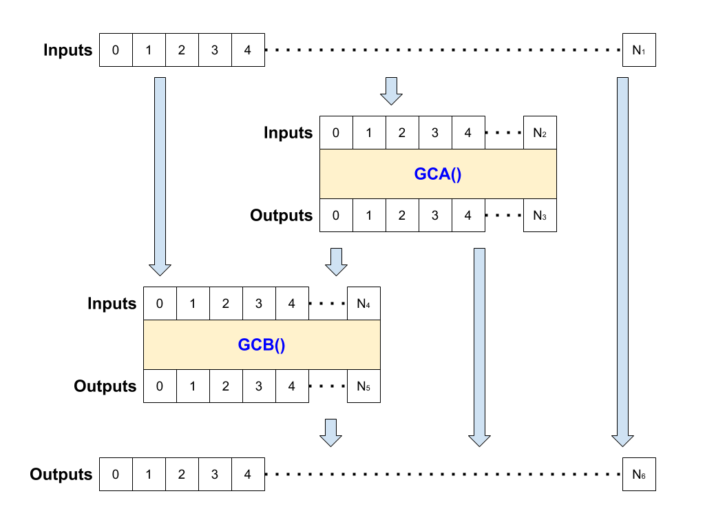

# Genomic Library

A genomic library stores genetic codes. A local genomic library stores the entire gene pool for the microbiome. A biome genomic library stores the super
set of the gene pools of its children (though somre extinction may occur due to space contraints).

Each entry in the genomic library is a single genetic code. There are two views of the genomic library data. The storage format as persisted in the database and the application format as viewed through the genomic library API.

## Genetic Code

A genetic code is a graph describing the connections going into, between and out of two other genetic codes, GC, A & B. The diagram below shows the
general arrangement.



A genetic code:

 * May take any number of inputs, including 0. i.e. 0 <= N<sub>1</sub>/N<sub>2</sub>/N<sub>4</sub> < infinity
 * Must always have at least 1 output. i.e. 0 < N<sub>3</sub>/N<sub>5</sub>/N<sub>6</sub> < infinity
 * All inputs must be connected.
 * All outputs must be connected.
 * Inputs and outputs of GCA and GCB may be connected multiple times.
 * Connections cannot form cycles i.e.
   * Inputs can be connected to GCA inputs, GCB inputs or directly to the outputs.
   * GCA outputs can be connected to GCB inputs or to the outputs.
   * GCB outputs must be connected to the outputs.

### Inputs & Outputs

All inputs and outputs are 32 bit floating point values.

### Codons

Leaf genetic codes, i.e. those that are not made up by the connection together of two other codes, are called *codons*. A codon genetic code
is identified by GCA and GCB both being NULL. In this case the inputs are connected in order to the codon function and the outputs to the codon
function outputs. The codon function is typically a primative e.g. addition, multiplication, logical operator etc. but is not required to be so.
It is defined in the [Meta_Data Field Format](###-meta_data-field-format) 

## Entry Storage Format

The storage format of the genomic library tries to reduce the space requirements whilst maintaining the ability to do all but corner case queries quickly.
Typically complex fields are stored compressed as byte strings. Below is the definition of a genetic code entry in the genomic library database table.
*IMMUTABLE* fields can never be changes once written. All other fields may be altered by the parent biome.

Field | Type | Restrictions | Description
----- | ---- | ------------ | -----------
graph | BYTEA | NOT NULL, IMMUTABLE | The definition of the code as a graph of other codes as a binary compressed array. See [Graph Field Format](###-graph-See field-format)
signature | BYTEA | PRIMARY KEY, IMMUTABLE | A binary [SHA256](https://en.wikipedia.org/wiki/SHA-2) of the graph field. The signature of a code is assumed to be unique in the codosphere.
GCA | BYTEA | IMMUTABLE | The signature of Genetic Code A or NULL if this genetic code is a codon. See [Genetic code](##-genetic-code).
GCB | BYTEA | IMMUTABLE | The signature of Genetic Code B or NULL if this genetic code is a codon. See [Genetic code](##-genetic-code).
generation | BIGINT | NOT NULL | The number of generations of genetic code evolved to create this code. A codon is generation always generation 1. This value may change if the creator changes.
references | BIGINT | NOT NULL | The number of times this code is referenced in other codes. If this code is referenced by code A once and no other then the reference count is 1. If genetic code X is then referenced by genetic code Y this code is referenced by both X & Y (through X) and the count is 2. This value will change over time.
code_depth | INTEGER | NOT NULL, IMMUTABLE | The depth of the code vertex graph.
codon_depth | INTEGER | NOT NULL, IMMUTABLE | The depth of the graph after expansion to codon vertices.  
num_codes | INTEGER | NOT NULL, IMMUTABLE | The number of vertices in the code vertex graph.
num_unique_codes | INTEGER | NOT NULL, IMMUTABLE | The number of unique codes in the code vertex graph.
raw_num_codons | INTEGER | NOT NULL, IMMUTABLE | The number of verticies in the codon vertex graph.
opt_num_codons | INTEGER |  | The number of verticies in the codon vertex graph after optimisation. As optimisations improve this value may change.
num_inputs | INTEGER | NOT NULL, IMMUTABLE | The number of inputs to the code. I0 in the [Graph Field Format](###-graph-field-format).
num_outputs | INTEGER | NOT NULL, IMMUTABLE | The number of outputs from the code. IN in the [Graph Field Format](###-graph-field-format).
classification | BIGINT | NOT NULL | A binary encoded classification. See [Classification Field Format](###-classification-field-format)
creator | BYTEA | NOT NULL | A binary [SHA256](https://en.wikipedia.org/wiki/SHA-2) hash identifying the creator. If the genetic code has been created in another microbiome at an earlier time then this field will be updated. 
created | TIMESTAMP | NOT NULL | The date and time of the codes creation. If the genetic code has been created in another microbiome at an earlier time then this field will be updated.
meta_data | BYTEA | NOT NULL | Other data associated with this code as a binary compressed JSON. See [Meta_Data Field Format](###-meta_data-field-format)

### Graph Field Format

The *graph* field is a binary gzip compatible [python zlib.compress(data, level=9)](https://docs.python.org/3/library/zlib.html) compressed
JSON structure defining the connections between the inputs, GCA, GCB and the outputs of the genetic code.

```json
[
   /* First is list of indices into the inputs of inputs into GCA. e.g. */
   [0, 5, 7, 4, 5, 6],

   /* Second is a list of references of inputs into genetic code B. Each reference */
   /* is a list of [source, index] where 'source' is 0 = inputs, 1 = outputs of GCA. e.g. */
   [[0, 1], [0, 3], [1, 4], [1, 0], [0, 2]],

   /* Third, and final, is a list of reference inputs into the outputs. Each reference has the same */
   /* format as above but 'source' may now also be 2 = outputs of GCB. e.g. */
   [[2, 0], [0, 2], [1, 1], [1, 2], [1, 3]]
]
```

### Classification Field Format

The *classification* field defines the classes that the genetic code is a member of. A genetic code may be a member of many classes although
some classes are mutally exclusive. The class definitions are stored as a bitfield.

Bit range (inclusive) | Description
--------------------- | -----------
[0] | Classification is extended by the *extended_class* dictionary in the *meta_data* field.
[1] | 1 if the genetic code is a codon else 0.
[2:7] | [Reserved](Glossary.md)
[8] | All codons in this genetic code are mathematical i.e. are valid operations in SymPy simplify()
[9] | All codons in this genetic code are logical operators i.e. the genetic code forms a truth table.
[10:63] | [Reserved](Glossary.md) 

:warning: Classification & its utility are largely TBD at this stage.

### Meta_Data Field Format

The *meta_data* field is a base 64 encoded [python base64.b64encode(data)](https://docs.python.org/3/library/base64.html) gzip compatible 
[python zlib.compress(data, level=9)](https://docs.python.org/3/library/zlib.html) compressed JSON object. This keeps the size down at the cost of transparency.
The JSON object is a dictionary which may contain any key:value pairs. Any key defined below may not be reappropriated for a different purpose and
all string keys starting with an underscore '_' are reserved:

Key | Description
--- | -----------
extended_class | A dictionary for additional classifications of the genetic code.
parents | A list of lists of parent signatures. See [Parents Key Value](####-parents-key-value).
function | A dictionary defining executable versions of the genetic code function. See [Function Key Value](####-Function-Key-Value).

#### Parents Key Value

The value of the *parents* key is a list of lists. Each sub-list consists of the *signatures* of the set of breeding parents
in the order oldest generation (lowest generation value) first. The sub-lists are independent lists of parents. Parents are
independent when they bear an offspring with the same signature as the offspring of a different set of parents i.e. by
chance (or evolutionary pressures) that a genetically the same offspring has been created. A genetic code always has at least
one parent unless is is a codon. Signatures are stored as hexadecimal strings.

#### Function Key Value

The value of the *function* key is a dictionary defining the executable versions of the genetic code if there are any. The general
structure of the dictionary is:

```json
{
   "function": {
      "python3": {
         "version_1": {
            "info": "string",
            "inline": "inline format string",
            "callable": "callable format string"
         },
         "version_2": {
            /* ... */
         },
         "version_N": {
            /* ... */
         }
      },
      "language_2": {
         /* ... */
      },
      "language_M": {
         /* ... */
      }
   }
}
```

Where:

Field | Valid Key Values or Key Type | Description
-------- | ------ | -----------
language_X | "python2"|"python3"|"ANSI C"|"C++" | The programming language the functional definition is written in
version_X | integer | The version of the language. The version is numeric and it is assumed versions within a language are backwards compatible.
info | "info" | The value of this key is an arbitary string giving more information on the language version.
inline | "inline" | The value for this key is a Python 3.5 format() compatible string defining the inline syntax of the function. There must be exactly
num_inputs + num_outputs "{}" references. The "{}" references will be populated with the outputs and then the inputs
in the order defined for the genetic code.
callable | "callable" | The value for this key is a Python 3.5 format() compatible string defining a callable syntax of the function.
There must be one "{}" reference which will be populated with the name of the function.

For example:

```json
{
   "function": {
      "python3": {
         0: {
            "info": "Python 3.x",
            "inline": "{} = {} + {}",
            "callable": "{}(x, y)\n\treturn x + y"
         },
      "ANSI C": {
         1999: {
            "info": "ANSI C99",
            "inline": "{} = {} + {}",
            "callable": "float {}(float x, float y) {{\n\treturn x + y;\n}}"
         }
}
```

Codons must have a *python3* version *0 inline* and *callable* definition. Any other language definitions and any definition for non-codon
genetic codes are optional and typically used to provide functionally identical but language optimised versions of the genetic code that
may be used in a reference library.

## Entry Application Format

In the application format the compression and complex data structure of the storage format is abstracted, the fields that
can only be calculated by the parent biome are not present and some additional fields are included to facilitate evolution.
The application format 


